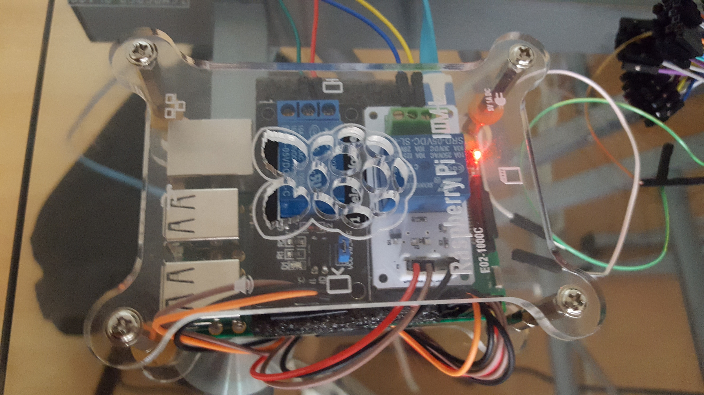

# Be your office hero
# \<iotdoor\>

## Description
This is a simple project with IoT, so at my office we got the problem to
always open the door with an intercom system. So with a raspberry pi and firebase I could develop an IoT system in order to open the door with a web app in polymer.




## Install the Polymer-CLI and Firebase CLI

First, make sure you have the Polymer installed and Firebase tools
```bash
$ npm install -g polymer-cli
$ npm install -g firebase-tools

```

## Viewing Your Application

```
$ firebase serve
```

## Building Your Application

```
$ polymer build
```

This will create builds of your application in the `build/` directory, optimized to be served in production. You can then serve the built versions by giving `polymer serve` a folder to serve from:


## Deploy Your Application

```
$ firebase deploy
```
